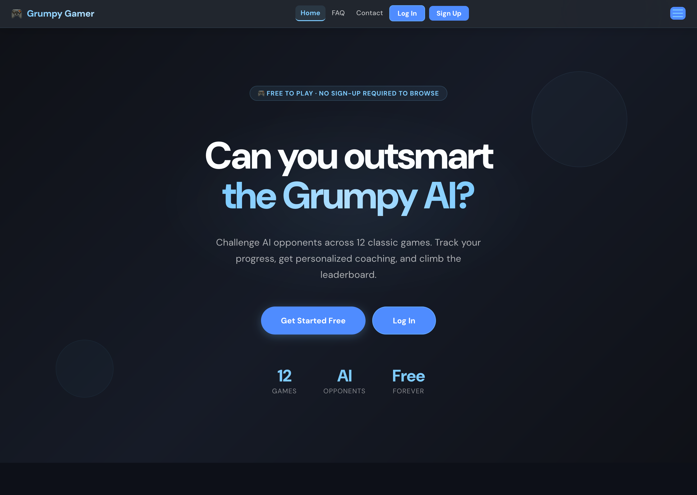
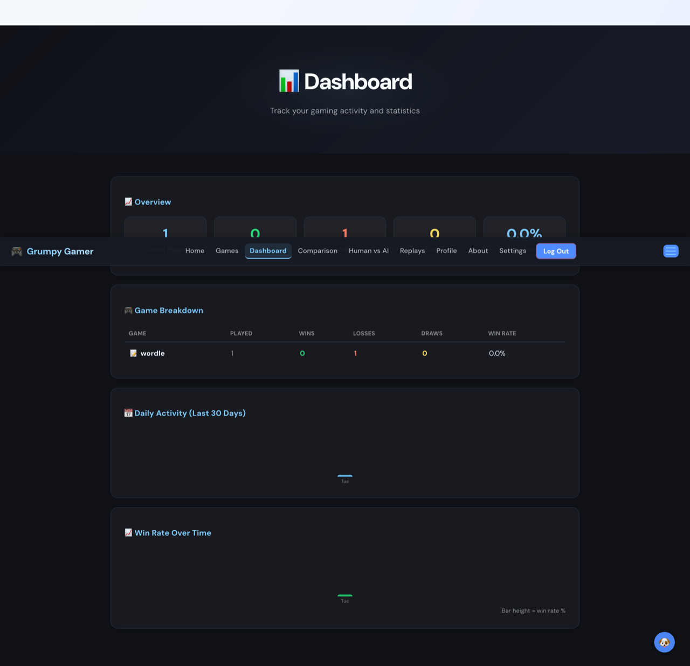
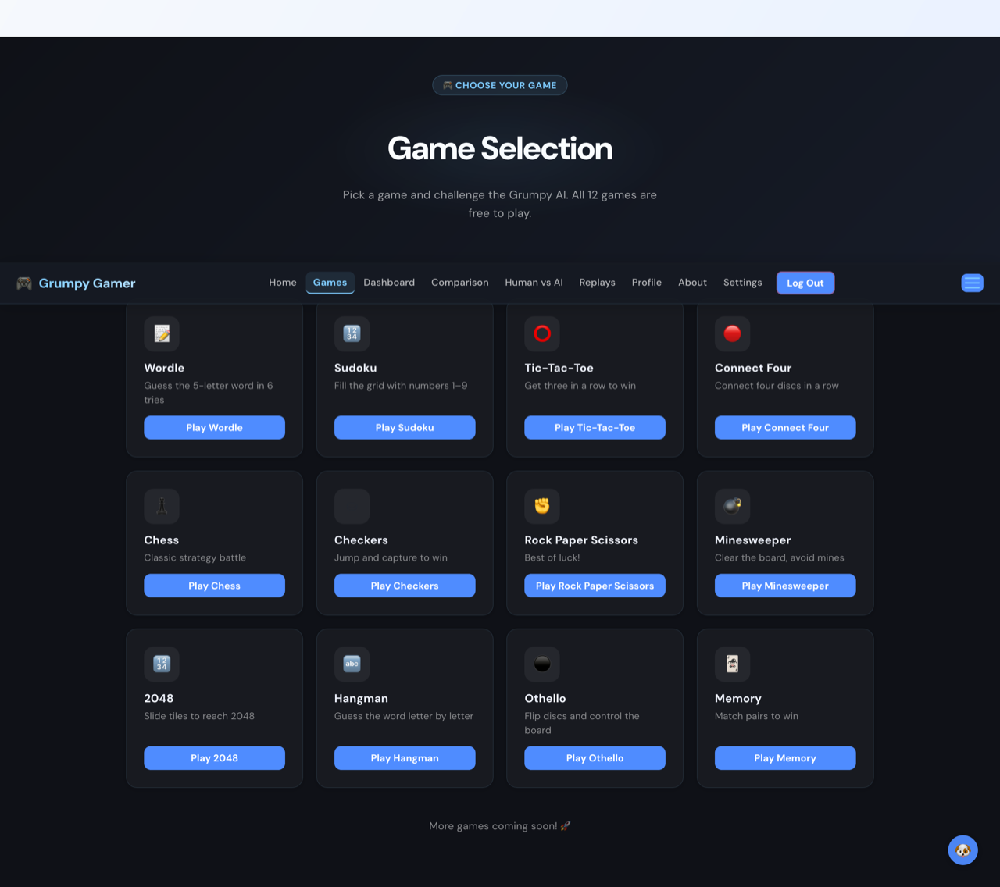
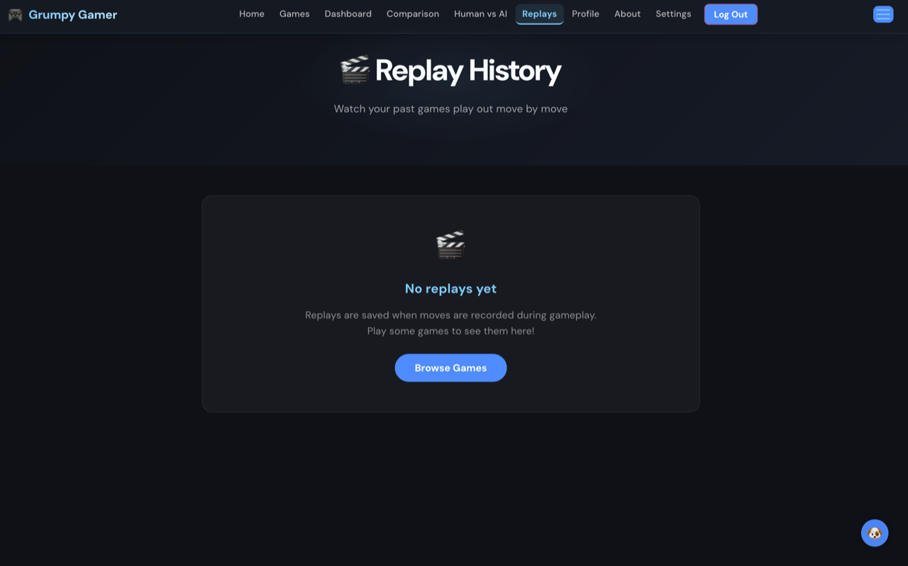
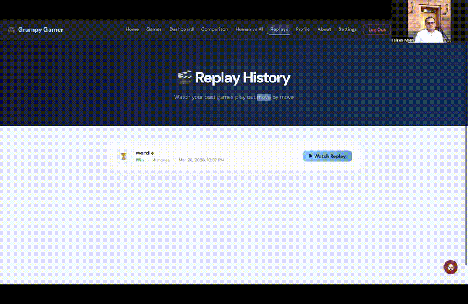
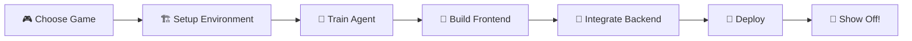

# 🎮 Grumpy Gamer
> **Teaching AI to rage-quit less than humans** *(eventually)*

<div align="center">


**[Live Demo](https://grumpy-gamer.vercel.app) · [API Docs](https://grumpy-gamer.onrender.com/docs) · [Slide Deck](https://docs.google.com/presentation/d/1nBV9nYjTpSZuZ35boGEnFM7Tr09Mkt9f74vHxj8Gt3A/edit?usp=sharing) · [Report Bug](https://github.com/jellyfishing2346/grumpy-gamer/issues)**

</div>

---

<div align="center">

## 🎬 Demo


## 📸 Screenshots

<div align="center">

### 🏠 Landing Page


### 📊 Dashboard


### 🎮 Game Selection


### 🎬 Replay Viewer


### ▶️ Replay Demo


</div>

*Challenge yourself against AI, compete with friends, and master classic games!*

</div>


## 📚 Table of Contents

- [What's This About?](#-whats-this-about)
- [Project Structure](#project-structure)
- [Key Features](#-key-features)
- [Tech Stack](#-tech-stack)
- [Project Roadmap](#-project-roadmap)
- [Quick Start](#-quick-start)
- [Usage](#usage)
- [Testing](#testing)
- [Deployment](#deployment)
- [Contributing](#-contributing)
- [License](#-license)
- [Contact](#contact)


## 🧠 What's This About?

**Grumpy Gamer** is a full-stack gaming platform where players challenge AI opponents powered by reinforcement learning across 12 classic games — Tic-Tac-Toe, Connect Four, Checkers, Chess, Minesweeper, Othello, 2048, Wordle, Sudoku, Hangman, Rock Paper Scissors, and Memory. Each AI agent is trained using deep RL and falls back to classical algorithms (Minimax, heuristics) when needed, so there's always a worthy opponent waiting.


## Project Structure
- `frontend/` — React + TypeScript UI (Create React App, React Router, inline styles)
- `backend/` — FastAPI server with game AI endpoints and auth
- `backend/rl/` — Reinforcement learning agents and training scripts
- `backend/rl/models/` — Trained model weights (.zip)
- `backend/rl/agents/` — Per-game RL agent implementations
- `tests/` — Unit and integration tests
- `docs/` — Documentation and research notes

## ✨ Key Features

<table>
<tr>
<td width="50%">

### 🤖 **7 AI-Powered Games**
- Tic-Tac-Toe, Connect Four, Checkers, Chess
- Minesweeper, Othello, 2048
- RL-trained models with classical fallbacks

</td>
<td width="50%">

### 🎯 **Play Against the AI**
- Real-time gameplay in your browser
- Multiple difficulty levels
- Smart move suggestions and hints

</td>
</tr>
<tr>
<td>

### 📊 **Game Statistics & Tracking**
- Win/loss/draw records per game
- Daily and lifetime stats
- Activity summaries and streaks

</td>
<td>

### 🔐 **User Authentication**
- Sign up and log in
- Track your personal stats
- Persistent game history

</td>
</tr>
</table>

## 🛠️ Tech Stack
```
┌─────────────────────────────────────────────────────────┐
│                                                         │
│  Frontend:   React + TypeScript + Create React App      │
│  Backend:    Python + FastAPI + Uvicorn                 │
│  ML/AI:      PyTorch + Stable Baselines3 + Gymnasium   │
│  Auth:       JWT Authentication                        │
│  Database:   PostgreSQL (via Render)                       │
│  Deploy:     Vercel (frontend) + Render (backend)      │
│                                                         │
└─────────────────────────────────────────────────────────┘
```

<details>
<summary><b>📦 Full Dependencies</b></summary>

**Backend:**
- ⚡ FastAPI — Modern async web framework
- 🔥 PyTorch — Deep learning framework
- 🎯 Stable Baselines3 — RL algorithms (PPO, DQN, A2C)
- 🎮 Gymnasium — RL environment interface
- 🦄 Uvicorn — ASGI server
- 🔐 JWT — User authentication
- 🗄️ PostgreSQL — Database (via Render)
- 📊 Pydantic — Data validation and serialization

**Frontend:**
- ⚛️ React 18 — UI framework
- 📘 TypeScript — Type safety
- ⚡ Create React App — Build tool and dev server
- 🧭 React Router — Client-side routing
- 🎨 Inline Styles — Dark theme styling
- 📈 Chart.js — Data visualization

**AI Agents (per game):**
- 🧠 RL-trained models (Stable Baselines3)
- ♟️ Minimax with alpha-beta pruning (Tic-Tac-Toe, Connect Four, Checkers, Chess, Othello)
- 🧩 Rule-based logic (Minesweeper)
- 📐 Heuristic strategies (2048)

</details>

## 🎯 Project Roadmap

```mermaid
graph LR
    A[🎮 Choose Game] --> B[🏗️ Setup Environment]
    B --> C[🧠 Train Agent]
    C --> D[🎨 Build Frontend]
    D --> E[🔗 Integrate Backend]
    E --> F[🚀 Deploy]
    F --> G[🎉 Show Off!]
```

- [x] Choose tech stack
- [x] Initialize repository
- [x] Set up development environment
- [x] Build React frontend with TypeScript + Create React App
- [x] Create FastAPI backend with game AI endpoints
- [x] Implement user authentication (signup/login)
- [x] Implement 12 game environments (Tic-Tac-Toe, Connect Four, Checkers, Chess, Minesweeper, Othello, 2048, Wordle, Sudoku, Hangman, RPS, Memory)
- [x] Build game statistics tracking system
- [x] Implement human vs AI gameplay
- [x] Deploy frontend to Vercel
- [x] Deploy backend to Render
- [x] Improve WordleAgent word list (1,243 words)
- [x] Add Wordle hard mode strategy
- [x] SudokuAgent performance benchmarking
- [x] Integration testing (66 tests passing)
- [x] Code cleanup and documentation
- [x] PostgreSQL database migration
- [x] Analytics API (game_results table + stats endpoints)
- [x] Wire up game results to backend (all 12 games)
- [x] Dashboard: win/loss/draw stats, daily activity, performance charts
- [x] AI vs Human comparison page with real data
- [x] AI Coach: Claude-powered glows/grows feedback
- [x] Spectator & Replay Mode (record moves, replay viewer, auto-playback, spectator sharing)
- [x] Profile page (view stats, edit username/email, change password)
- [x] Loading skeletons on Dashboard and Human vs AI
- [x] Empty state illustrations
- [x] Full UX/Visual redesign (dark aesthetic across all pages)
- [x] Refined UI & Game Feel (token expiry, toast notifications, play again, page transitions, mobile responsive, hover/focus states, page titles, replay recording)
- [x] Performance Optimization (lazy loading, DB indexes, API caching, memoization, pagination, Lighthouse fixes)
- [x] Deployment Refinement (CI testing, Sentry, health check, keep-alive, rate limiting, env vars, CORS, CONTRIBUTING.md, deployment docs)
- [x] Documentation & Testing (screenshots, Swagger docs, JSDoc, backend tests 27 passing, frontend tests 23 passing, Playwright E2E 12 passing, TypeScript strict, error boundaries)
- [x] Final Presentation & Handover (demo GIF, slide deck, README polish, project summary, bug sweep, metrics)
- [x] AI & RL Training (DQN/PPO agents for TicTacToe 83%/ConnectFour 96%/Checkers 50%/Othello 20%, training metrics dashboard, model versioning, difficulty levels, RL indicators)
- [x] Demo video walkthrough
- [x] Add real-time multiplayer with WebSockets (TicTacToe, room codes, rematch support) ⚔️
- [x] Design training metrics dashboard
- [x] Write comprehensive documentation (Swagger, JSDoc, CONTRIBUTING.md, RL_AGENTS.md, METRICS.md, PROJECT_SUMMARY.md)
- [x] Create demo video

## 🚀 Quick Start
```bash
# Clone the repository
git clone https://github.com/jellyfishing2346/grumpy-gamer.git
cd grumpy-gamer

# Frontend setup
cd frontend
npm install
npm run dev          # Runs on http://localhost:3000

# Backend setup (separate terminal)
cd backend
pip install -r requirements.txt
uvicorn main:app --reload   # Runs on http://localhost:8000
```


## Usage

Once the app is running, open your browser to [http://localhost:3000](http://localhost:3000) to:
- Create an account or log in
- Browse and play 12 classic games against AI opponents
- Track your wins, losses, and streaks on the stats dashboard
- Challenge yourself at different difficulty levels

Or visit the live demo at **[grumpy-gamer.vercel.app](https://grumpy-gamer.vercel.app)**

## Testing

Frontend:
```bash
cd frontend
npm test
```

Backend:
```bash
cd backend
pytest
```

## Deployment

### Frontend — Vercel
```bash
cd frontend
npm run build
# Push to GitHub — Vercel auto-deploys from main branch
```
- Root directory: `frontend`
- Auto-deploys on every push to `main`
- Live at: https://grumpy-gamer.vercel.app

### Backend — Render
- Uses `Procfile`: `web: uvicorn api:app --host 0.0.0.0 --port ${PORT:-8000}`
- Auto-deploys from GitHub on every push to `main`
- Live at: https://grumpy-gamer.onrender.com

#### Required Environment Variables on Render
| Variable | Required | Value |
|----------|----------|-------|
| `ENV` | ✅ | `production` |
| `SECRET_KEY` | ✅ | Your JWT secret key |
| `DATABASE_URL` | ✅ | PostgreSQL connection string from Render |
| `ANTHROPIC_API_KEY` | ✅ | API key for AI Coach feature |
| `RENDER_EXTERNAL_URL` | ✅ | `https://grumpy-gamer.onrender.com` |
| `CHATBOT_USE_LLM` | ⬜ | `false` (set to `true` to enable OpenAI) |
| `OPENAI_API_KEY` | ⬜ | OpenAI API key (if CHATBOT_USE_LLM=true) |
| `SENTRY_DSN` | ⬜ | Sentry DSN for error monitoring |
| `ALLOWED_ORIGINS` | ⬜ | Custom CORS origins (comma separated) |

#### Required Environment Variables on Vercel
| Variable | Required | Value |
|----------|----------|-------|
| `REACT_APP_SENTRY_DSN` | ⬜ | Sentry DSN for frontend error monitoring |

#### Database Migrations
The database schema is created automatically on startup via `init_db()` in `auth.py`. Tables and indexes are created with `IF NOT EXISTS` so it is safe to run multiple times. No manual migrations are needed.

#### ⚠️ Render Free Tier — Cold Start Issue
Render's free tier spins down after 15 minutes of inactivity, causing the first request to take **50+ seconds**. To keep the backend alive 24/7 without upgrading:

**Solution: cron-job.org keep-alive ping**
- Service: [cron-job.org](https://cron-job.org) (free)
- URL: `https://grumpy-gamer.onrender.com/`
- Schedule: Every 10 minutes (`*/10 * * * *`)
- This prevents Render from spinning down during active hours

To set up:
1. Create a free account at [cron-job.org](https://cron-job.org)
2. Click "Create Cronjob"
3. Set URL to `https://grumpy-gamer.onrender.com/`
4. Set schedule to "Every 10 minutes"
5. Save and enable

> **Note:** If no one visits the site for an extended period overnight, Render may still spin down. For guaranteed uptime, upgrade to Render's paid tier ($7/month).


---

## 🎮 How It Works

<div align="center">

```
┌──────────────┐
│  Game State  │
│  (board)     │
└──────┬───────┘
       │
       ▼
┌──────────────┐
│  RL Agent    │  ← Trained via PPO / DQN
│  (AI Brain)  │  ← Falls back to Minimax
└──────┬───────┘
       │
       ▼
┌──────────────┐
│   Action     │  → Place piece, move, click
└──────┬───────┘
       │
       ▼
┌──────────────┐
│   Reward     │  → Win: +1 | Lose: -1 | Draw: 0
└──────────────┘
       │
       │ Repeat 1,000,000 times
       └──────────┐
                  │
                  ▼
            🏆 Pro Gamer
```

</div>

Each game AI uses **Proximal Policy Optimization (PPO)** or **Deep Q-Networks (DQN)** to learn optimal strategies through self-play. When a trained model isn't available, the agent seamlessly falls back to classical algorithms like Minimax with alpha-beta pruning — so the AI is always ready to play.


## 🎨 Screenshots

> Coming soon! The AI is still learning not to run into walls...


## 📈 Performance

| Game | AI Strategy | Fallback | Status |
|------|------------|----------|--------|
| Tic-Tac-Toe | PPO / DQN | Minimax (α-β) | ✅ Playable |
| Connect Four | PPO / DQN | Minimax (heuristic) | ✅ Playable |
| Checkers | PPO / DQN | Minimax | ✅ Playable |
| Chess | PPO / DQN | Minimax | ✅ Playable |
| Minesweeper | PPO / DQN | Rule-based logic | ✅ Playable |
| Othello | PPO / DQN | Minimax | ✅ Playable |
| 2048 | PPO / DQN | Heuristic | ✅ Playable |

## 📝 License

MIT © [Faizan Khan]

---

## Contact

For questions, support, or business inquiries, please open an issue or contact [Faizan Khan](mailto:faizanakhan2003@gmail.com).

---

<div align="center">

**Built with 🧠 and lots of ☕**

*"The AI doesn't get frustrated, which makes it inherently better than me at gaming"*

[⬆ Back to Top](#-grumpy-gamer)

</div>