# 🎮 Grumpy Gamer

> **Teaching AI to rage-quit less than humans** *(eventually)*

<div align="center">


**[Demo]() · [Documentation]() · [Report Bug](https://github.com/jellyfish2346/grumpy-gamer/issues)**

</div>

---

## 🧠 What's This About?

**Grumpy Gamer** is a project to explore whether AI can beat classic games such as Wordle, Sudoku, and more. The goal is to implement game environments and develop AI agents that can play and potentially master these games using various algorithms, including rule-based logic, search, and machine learning. 

## Project Structure
- games/: Game environments (Wordle, Sudoku, etc.)
- agents/: AI agents for each game
- scripts/: Utilities to run experiments and evaluate agents
- tests/: Unit and integration tests
- docs/: Documentation and research notes

## ✨ Key Features

<table>
<tr>
<td width="50%">

### 🤖 **Smart AI Agent**
- Learns through reinforcement learning
- Deep neural network decision-making  
- Thousands of hours of practice in minutes

</td>
<td width="50%">

### 🎯 **Interactive Demo**
- Watch the AI play in real-time
- Challenge it yourself (good luck!)
- See inside its "brain" with visualizations

</td>
</tr>
<tr>
<td>

### 📊 **Training Dashboard**
- Live training metrics
- Performance graphs
- Compare different agents

</td>
<td>

### 🚀 **Full-Stack Application**
- Sleek React frontend
- Fast Python backend
- Deployed and ready to share

</td>
</tr>
</table>

## 🛠️ Tech Stack
```ascii
┌─────────────────────────────────────────────────────────┐
│                                                         │
│  Frontend:   React + TypeScript + Socket.io            │
│  Backend:    Python + FastAPI + WebSockets             │
│  ML Core:    PyTorch + Stable Baselines3               │
│  Game Env:   Gymnasium + gym-retro                     │
│  Database:   PostgreSQL + Redis                        │
│  Deploy:     Docker + Heroku/Vercel                    │
│                                                         │
└─────────────────────────────────────────────────────────┘
```

<details>
<summary><b>📦 Full Dependencies</b></summary>

**Backend:**
- 🔥 PyTorch - Deep learning framework
- 🎯 Stable Baselines3 - RL algorithms (PPO, DQN, A2C)
- ⚡ FastAPI - Modern web framework
- 🎮 Gymnasium - RL environment interface
- 🕹️ gym-retro - Classic game environments

**Frontend:**
- ⚛️ React - UI framework
- 📘 TypeScript - Type safety
- 🔌 Socket.io - Real-time communication
- 📈 Chart.js - Data visualization
- 🎨 Tailwind CSS - Styling

**Infrastructure:**
- 🐳 Docker - Containerization
- 🗄️ PostgreSQL - Data storage
- ⚡ Redis - Caching
- ☁️ Heroku/Vercel - Deployment

</details>

## 🎯 Project Roadmap

```mermaid
graph LR
    A[🎮 Choose Game] --> B[🏗️ Setup Environment]
    B --> C[🧠 Train Agent]
    C --> D[🎨 Build Frontend]
    D --> E[🔗 Integrate Backend]
    E --> F[🚀 Deploy]
    F --> G[🎉 Show Off!]
```


- [x] Choose tech stack
- [x] Initialize repository
- [ ] Set up development environment
- [ ] Implement RL training pipeline
- [ ] Train first successful agent
- [ ] Build React frontend
- [ ] Create FastAPI backend with WebSocket support
- [ ] Design training metrics dashboard
- [ ] Implement human vs AI gameplay
- [ ] Add model comparison features
- [ ] Write comprehensive documentation
- [ ] Deploy to production
- [ ] Create demo video

## 🚀 Quick Start
```bash
# Clone the repository
git clone https://github.com/jellyfish2346/grumpy-gamer.git
cd grumpy-gamer

# Setup coming soon! 🏗️
```

## 🎮 How It Works

<div align="center">
```
┌──────────────┐
│  Game State  │
│   (pixels)   │
└──────┬───────┘
       │
       ▼
┌──────────────┐
│ Neural Net   │  ← Learns from experience
│  (AI Brain)  │
└──────┬───────┘
       │
       ▼
┌──────────────┐
│   Actions    │  → Joystick movements
│ (Up/Down/etc)│
└──────┬───────┘
       │
       ▼
┌──────────────┐
│   Reward     │  → Did we win? +1 : -1
└──────────────┘
       │
       │ Repeat 1,000,000 times
       └──────────┐
                  │
                  ▼
            🏆 Pro Gamer
```

</div>

The AI uses **Proximal Policy Optimization (PPO)** to learn optimal gameplay strategies. It starts random, fails hilariously, then gradually discovers winning tactics through millions of attempts. Think of it as speed-running human childhood gaming experience.

## 🎨 Screenshots

> Coming soon! The AI is still learning not to run into walls...

## 📈 Performance

| Metric | Human Average | Grumpy Gamer |
|--------|--------------|--------------|
| High Score | TBD | 🚧 Training... |
| Win Rate | TBD | 🚧 Training... |
| Rage Quits | High 😤 | Zero 😎 |

## 🤝 Contributing

This is a portfolio project, but feel free to:
- 🐛 Report bugs
- 💡 Suggest features  
- ⭐ Star the repo if you think it's cool!

## 📝 License

MIT © [Faizan Khan]

---

<div align="center">

**Built with 🧠 and lots of ☕**

*"The AI doesn't get frustrated, which makes it inherently better than me at gaming"*

[⬆ Back to Top](#-grumpy-gamer)

</div>
